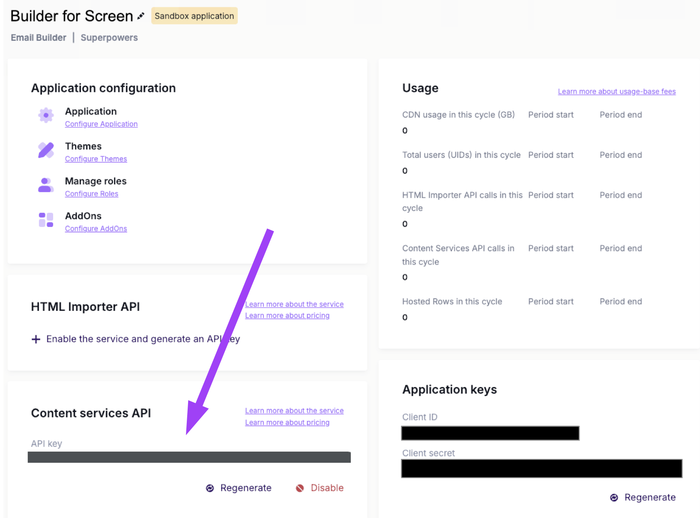

# Beefree Check SDK API Overview

You need the **Beefree SDK Content Services API KEY**




### API Endpoints
|                        |                   |
| ---------------------- | ----------------- |
| POST /v1/message/check | for emails        |
| POST /v1/page/check    | for landing pages |
| POST /v1/row/check     | for rows          |

Same JSON body request:
```
{
  "checks": list of checks to perform - Required,
  "template": Beefree's json of the email, page or row - Required
  "languages": list of secondary languages to evaluate - optional
}
```

With secondary languages, the check works in incremental way:
  - list of checks results on main language and
  - for each language:
    - checks results on that message sections on this language


### Available checks
 Complete details on https://docs.beefree.io/beefree-sdk/apis/content-services-api/check

| Check code          | Short description                            | Severity   | For emails | For pages | For rows | Widgets checked                   |
| ------------------- | -------------------------------------------- | ---------- | ---------- | --------- | -------- | --------------------------------- |
| missingAltText      | Highlight missing alternative text in images | warning    | x          | x         | x        | gif, image, sticker, icon, social |
| missingImageLink    | Highlight missing link (`href`) on images    | suggestion | x          | x         | x        | gif, image, sticker, icon         |
| missingCopyLink     | Highlight missing link (`href`) on copy      | warning    | x          | x         | x        | button, social, menu              |
| overageImageWeight  | Highlight image overage weight               | warning    | x          | x         | x        | gif, image, sticker, icon, social |
| overageHtmlWeight   | Highlight HTML overage size                  | warning    | x          | -         | -        | -                                 |
| missingDetailsEmail | Highlight missing subject and pre header     | suggestion | x          | -         | -        | -                                 |
| missingDetailsPage  | Highlight missing description and title      | suggestion | -          | x         | -        | -                                 |

You create your list of checks!

If warning and suggestion, the general status is warning.

You get an `Error400 - Bad Request` if you ask for a check not available for that kind of message.

### Hands on request example
Examples are on checks for emails on the main/default language.

[Request example with a empty template](./request_http/request_base.http)

[Request example with 2 checks and a simple template](./request_http/request_simple_template.http)

[Request example with 6 checks and a simple template](./request_http/request_simple_template_all_tests.http)

[Request example with a complex template](./request_http/request_complex_template.http)


## Stay tuned
Other checks will be released and **we are open to define some of them with you**.
